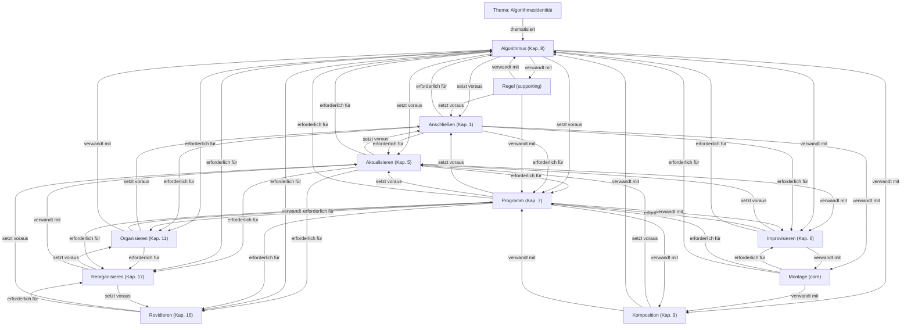

# Begriffsnetz: Algorithmusidentität

Status: lesendes Begriffsnetz; keine Theorieentscheidung

## Begriffe

- **Aktualisieren** (`aktualisieren`, Kapitel 5, Status: core): Eine Anschlussmöglichkeit in einen bestimmten Vollzug überführen.
- **Algorithmus** (`algorithmus`, Kapitel 8, Status: core): wiederholbare Ordnung bedingter Übergänge
- **Anschließen** (`anschliessen`, Kapitel 1, Status: core): Anschließen bezeichnet den Eintritt in einen bereits begonnenen Zusammenhang, durch den eine Möglichkeit aktualisiert und der Raum weiterer Anschlüsse verändert wird.
- **Improvisieren** (`improvisieren`, Kapitel 6, Status: core): Formgebundene und formbildende Tätigkeit unter Bedingungen partieller Unbestimmtheit.
- **Komposition** (`komposition`, Kapitel 9, Status: derived): Ergebnis oder Zusammenhang des Komponierens, in dem Elemente, Übergänge und Relationen angeordnet sind.
- **Montage** (`montage`, Status: core): Epistemisches Modell relationaler Formbildung, in dem Auswahl, Unterbrechung, Übergang, Variation, Komposition, Stabilisierung und Revision praktisch sichtbar werden.
- **Organisieren** (`organisieren`, Kapitel 11, Status: core): Mehrere Anschlussbedingungen in einen Zusammenhang bringen, in dem sie einander ermöglichen, begrenzen, priorisieren oder ausschließen.
- **Programm** (`programm`, Kapitel 7, Status: core): wirksame Vorordnung möglicher Anschlüsse
- **Regel** (`regel`, Status: supporting): Eine wiedererkennbare Bedingung, die mögliche Anschlüsse ordnet, ohne den Vollzug vollständig zu bestimmen.
- **Reorganisieren** (`reorganisieren`, Kapitel 17, Status: core): Die Beziehungen verändern, durch die mehrere Anschlussbedingungen einander stützen, begrenzen und für weitere Vollzüge wirksam werden.
- **Revidieren** (`revidieren`, Kapitel 16, Status: core): Begründetes Zurückkommen auf stabilisierte Anschlussbedingungen, um sie im Licht ihrer Wirkungen, veränderter Umstände oder neu erschlossener Möglichkeiten erneut zu bestimmen.

## Manuskriptanker

- `manuskript\17-reorganisieren.md:105` (algorithmus, improvisieren, montage, organisieren, programm, reorganisieren) — Die Masterarbeit konkretisiert diese Bewegung programmatisch und technisch. Der Montage-Automat verbindet ein vorgeordnetes Programm, einen ausführenden Algorithmus, Untertitelmaterial und improvisatorische Weiterbearbei
- `manuskript\08-algorithmus.md:91` (algorithmus, anschliessen, improvisieren, komposition, montage) — Zugleich zeigt die historische Untersuchung algorithmischer Filmkomposition, dass eine solche Ordnung nicht an Computer gebunden ist. Notationen und Schemata konnten filmische Übergänge vorordnen, die anschließend von Me
- `manuskript\09-komponieren.md:106` (algorithmus, anschliessen, improvisieren, komposition, programm) — Ebenso kann ein Kompositionsprozess weitgehend vorgeordnet sein, ohne improvisatorisch zu verlaufen. Werden Auswahl, Übergänge und ihre Beziehungen hinreichend durch Programme und Algorithmen bestimmt, kann eine Komposit
- `manuskript\10-stabilisieren.md:111` (aktualisieren, algorithmus, anschliessen, improvisieren, programm) — Damit wechselt die Analyseebene. Teil I hat untersucht, wie Anschlüsse aufgenommen, unterbrochen, problematisiert, geformt, aktualisiert, improvisiert, programmiert, algorithmisch geordnet, komponiert und stabilisiert we
- `manuskript\12-verteilen.md:125` (aktualisieren, anschliessen, organisieren, reorganisieren, revidieren) — Die nächste Frage richtet sich auf diese Ungleichheit der Rückwirkung. Wenn Positionen nicht in vergleichbarer Weise aktualisieren, bestimmen, revidieren oder reorganisieren können, tritt eine Asymmetrie der Anschlussbed

## Grenzen

- Das Netz zeigt deklarierte und textuell gefundene Anschlüsse.
- Es bestätigt keine neuen Definitionen.
- Nicht gefundene Begriffe können dennoch philosophisch relevant sein.
