# Begriffsnetz: Generierung Aktualisierung Programm Revision Reorganisation Quellenkontext

Status: lesendes Begriffsnetz; keine Theorieentscheidung

```mermaid
graph TD
  theme["Thema: Generierung Aktualisierung Programm Revision Reorganisation Quellenkontext"]
  theme -->|thematisiert| c_aktualisieren["Aktualisieren"]
  theme -->|thematisiert| c_programm["Programm"]
  theme -->|thematisiert| c_reorganisieren["Reorganisieren"]
  theme -->|thematisiert| c_revidieren["Revidieren"]
  theme -->|thematisiert| c_algorithmus["Algorithmus"]
  theme -->|thematisiert| c_montage["Montage"]
  theme -->|thematisiert| c_regel["Regel"]
  c_aktualisieren["Aktualisieren (Kap. 5)"]
  c_algorithmus["Algorithmus (Kap. 8)"]
  c_anschliessen["Anschließen (Kap. 1)"]
  c_asymmetrie["Asymmetrie (Kap. 13)"]
  c_beurteilen["Beurteilen (Kap. 15)"]
  c_form["Form (Kap. 4)"]
  c_fortsetzen["Fortsetzen (supporting)"]
  c_improvisieren["Improvisieren (Kap. 6)"]
  c_kommunikation["Kommunikation (boundary)"]
  c_komposition["Komposition (Kap. 9)"]
  c_kritisieren["Kritisieren (Kap. 14)"]
  c_moeglichkeitsraum["Möglichkeitsraum (supporting)"]
  c_montage["Montage (core)"]
  c_organisieren["Organisieren (Kap. 11)"]
  c_problematisieren["Problematisieren (Kap. 3)"]
  c_programm["Programm (Kap. 7)"]
  c_regel["Regel (supporting)"]
  c_reorganisieren["Reorganisieren (Kap. 17)"]
  c_revidieren["Revidieren (Kap. 16)"]
  c_stabilisieren["Stabilisieren (Kap. 10)"]
  c_unterbrechen["Unterbrechen (Kap. 2)"]
  c_verteilen["Verteilen (Kap. 12)"]
  c_aktualisieren -->|setzt voraus| c_anschliessen
  c_aktualisieren -->|erforderlich für| c_programm
  c_aktualisieren -->|erforderlich für| c_algorithmus
  c_aktualisieren -->|erforderlich für| c_revidieren
  c_aktualisieren -->|erforderlich für| c_reorganisieren
  c_aktualisieren -->|verwandt mit| c_form
  c_aktualisieren -->|verwandt mit| c_improvisieren
  c_algorithmus -->|setzt voraus| c_anschliessen
  c_algorithmus -->|setzt voraus| c_aktualisieren
  c_algorithmus -->|setzt voraus| c_programm
  c_algorithmus -->|erforderlich für| c_organisieren
  c_algorithmus -->|erforderlich für| c_revidieren
  c_algorithmus -->|erforderlich für| c_reorganisieren
  c_algorithmus -->|verwandt mit| c_improvisieren
  c_algorithmus -->|verwandt mit| c_komposition
  c_algorithmus -->|verwandt mit| c_regel
  c_anschliessen -->|erforderlich für| c_unterbrechen
  c_anschliessen -->|erforderlich für| c_problematisieren
  c_anschliessen -->|erforderlich für| c_form
  c_anschliessen -->|erforderlich für| c_aktualisieren
  c_anschliessen -->|erforderlich für| c_improvisieren
  c_anschliessen -->|erforderlich für| c_programm
  c_anschliessen -->|erforderlich für| c_algorithmus
  c_anschliessen -->|erforderlich für| c_organisieren
  c_anschliessen -->|verwandt mit| c_fortsetzen
  c_anschliessen -->|verwandt mit| c_kommunikation
  c_anschliessen -->|verwandt mit| c_montage
  c_asymmetrie -->|setzt voraus| c_verteilen
  c_asymmetrie -->|setzt voraus| c_organisieren
  c_asymmetrie -->|erforderlich für| c_kritisieren
  c_beurteilen -->|setzt voraus| c_kritisieren
  c_beurteilen -->|erforderlich für| c_revidieren
  c_form -->|setzt voraus| c_anschliessen
  c_form -->|setzt voraus| c_problematisieren
  c_form -->|erforderlich für| c_aktualisieren
  c_form -->|erforderlich für| c_improvisieren
  c_form -->|erforderlich für| c_programm
  c_form -->|verwandt mit| c_montage
  c_fortsetzen -->|setzt voraus| c_anschliessen
  c_fortsetzen -->|verwandt mit| c_unterbrechen
  c_improvisieren -->|setzt voraus| c_aktualisieren
  c_improvisieren -->|setzt voraus| c_form
  c_improvisieren -->|erforderlich für| c_programm
  c_improvisieren -->|erforderlich für| c_algorithmus
  c_improvisieren -->|verwandt mit| c_montage
  c_kommunikation -->|setzt voraus| c_anschliessen
  c_komposition -->|setzt voraus| c_form
  c_komposition -->|setzt voraus| c_aktualisieren
  c_komposition -->|verwandt mit| c_algorithmus
  c_komposition -->|verwandt mit| c_programm
  c_kritisieren -->|setzt voraus| c_asymmetrie
  c_kritisieren -->|setzt voraus| c_problematisieren
  c_kritisieren -->|erforderlich für| c_beurteilen
  c_moeglichkeitsraum -->|setzt voraus| c_anschliessen
  c_moeglichkeitsraum -->|erforderlich für| c_programm
  c_moeglichkeitsraum -->|verwandt mit| c_aktualisieren
  c_montage -->|setzt voraus| c_form
  c_montage -->|erforderlich für| c_improvisieren
  c_montage -->|erforderlich für| c_programm
  c_montage -->|erforderlich für| c_algorithmus
  c_montage -->|verwandt mit| c_komposition
  c_organisieren -->|setzt voraus| c_anschliessen
  c_organisieren -->|erforderlich für| c_verteilen
  c_organisieren -->|erforderlich für| c_asymmetrie
  c_organisieren -->|erforderlich für| c_kritisieren
  c_organisieren -->|erforderlich für| c_reorganisieren
  c_organisieren -->|verwandt mit| c_programm
  c_organisieren -->|verwandt mit| c_algorithmus
  c_problematisieren -->|setzt voraus| c_anschliessen
  c_problematisieren -->|setzt voraus| c_unterbrechen
  c_problematisieren -->|erforderlich für| c_form
  c_problematisieren -->|erforderlich für| c_kritisieren
  c_programm -->|setzt voraus| c_anschliessen
  c_programm -->|setzt voraus| c_aktualisieren
  c_programm -->|setzt voraus| c_form
  c_programm -->|erforderlich für| c_algorithmus
  c_programm -->|erforderlich für| c_organisieren
  c_programm -->|erforderlich für| c_revidieren
  c_programm -->|erforderlich für| c_reorganisieren
  c_programm -->|verwandt mit| c_improvisieren
  c_programm -->|verwandt mit| c_komposition
  c_programm -->|verwandt mit| c_moeglichkeitsraum
  c_regel -->|setzt voraus| c_anschliessen
  c_regel -->|verwandt mit| c_programm
  c_regel -->|verwandt mit| c_algorithmus
  c_reorganisieren -->|setzt voraus| c_organisieren
  c_reorganisieren -->|setzt voraus| c_revidieren
  c_reorganisieren -->|verwandt mit| c_aktualisieren
  c_revidieren -->|setzt voraus| c_aktualisieren
  c_revidieren -->|setzt voraus| c_beurteilen
  c_revidieren -->|erforderlich für| c_reorganisieren
  c_revidieren -->|verwandt mit| c_stabilisieren
  c_stabilisieren -->|setzt voraus| c_aktualisieren
  c_stabilisieren -->|erforderlich für| c_revidieren
  c_stabilisieren -->|verwandt mit| c_komposition
  c_unterbrechen -->|setzt voraus| c_anschliessen
  c_unterbrechen -->|erforderlich für| c_problematisieren
  c_unterbrechen -->|verwandt mit| c_fortsetzen
  c_verteilen -->|setzt voraus| c_organisieren
  c_verteilen -->|erforderlich für| c_asymmetrie
```

## Begriffe

- **Aktualisieren** (`aktualisieren`, Kapitel 5, Status: core): Eine Anschlussmöglichkeit in einen bestimmten Vollzug überführen.
- **Algorithmus** (`algorithmus`, Kapitel 8, Status: core): wiederholbare Ordnung bedingter Übergänge
- **Anschließen** (`anschliessen`, Kapitel 1, Status: core): Anschließen bezeichnet den Eintritt in einen bereits begonnenen Zusammenhang, durch den eine Möglichkeit aktualisiert und der Raum weiterer Anschlüsse verändert wird.
- **Asymmetrie** (`asymmetrie`, Kapitel 13, Status: core): Eine relationale Ungleichheit von Anschlussbedingungen, durch die Beteiligte nicht in gleicher Weise aktualisieren, bestimmen, revidieren oder reorganisieren können.
- **Beurteilen** (`beurteilen`, Kapitel 15, Status: core): Unterschiede zwischen möglichen und aktualisierten Ordnungen anhand ausweisbarer Maßstäbe bestimmen, ohne den Maßstab als voraussetzungslos zu behandeln.
- **Form** (`form`, Kapitel 4, Status: core): Eine relationale Bestimmung, durch die Unterschiede für weitere Anschlüsse wirksam werden.
- **Fortsetzen** (`fortsetzen`, Status: supporting): Einen Zusammenhang so weiterführen, dass an bereits wirksame Bedingungen angeschlossen wird.
- **Improvisieren** (`improvisieren`, Kapitel 6, Status: core): Formgebundene und formbildende Tätigkeit unter Bedingungen partieller Unbestimmtheit.
- **Kommunikation** (`kommunikation`, Status: boundary): Möglicher Bereich des Anschließens, auf den Anschluss im Projekt nicht reduziert wird.
- **Komposition** (`komposition`, Kapitel 9, Status: derived): Ergebnis oder Zusammenhang des Komponierens, in dem Elemente, Übergänge und Relationen angeordnet sind.
- **Kritisieren** (`kritisieren`, Kapitel 14, Status: core): Die Bedingungen, Formen und Folgen organisierter Anschlüsse wahrnehmbar und einer begründeten Beurteilung zugänglich machen.
- **Möglichkeitsraum** (`moeglichkeitsraum`, Status: supporting): Relationale Ordnung der unter bestimmten Bedingungen praktisch aktualisierbaren Anschlussmöglichkeiten.
- **Montage** (`montage`, Status: core): Epistemisches Modell relationaler Formbildung, in dem Auswahl, Unterbrechung, Übergang, Variation, Komposition, Stabilisierung und Revision praktisch sichtbar werden.
- **Organisieren** (`organisieren`, Kapitel 11, Status: core): Mehrere Anschlussbedingungen in einen Zusammenhang bringen, in dem sie einander ermöglichen, begrenzen, priorisieren oder ausschließen.
- **Problematisieren** (`problematisieren`, Kapitel 3, Status: core): Eine zunächst unbestimmte Fraglichkeit selektiv als bearbeitbare Frage fassen, ohne damit bereits ihre Lösung, Form oder Beurteilung festzulegen.
- **Programm** (`programm`, Kapitel 7, Status: core): wirksame Vorordnung möglicher Anschlüsse
- **Regel** (`regel`, Status: supporting): Eine wiedererkennbare Bedingung, die mögliche Anschlüsse ordnet, ohne den Vollzug vollständig zu bestimmen.
- **Reorganisieren** (`reorganisieren`, Kapitel 17, Status: core): Die Beziehungen verändern, durch die mehrere Anschlussbedingungen einander stützen, begrenzen und für weitere Vollzüge wirksam werden.
- **Revidieren** (`revidieren`, Kapitel 16, Status: core): Begründetes Zurückkommen auf stabilisierte Anschlussbedingungen, um sie im Licht ihrer Wirkungen, veränderter Umstände oder neu erschlossener Möglichkeiten erneut zu bestimmen.
- **Stabilisieren** (`stabilisieren`, Kapitel 10, Status: core): Anschlussbedingungen so festigen, dass sie über einzelne Vollzüge hinaus wiedererkennbar und wirksam bleiben, ohne dadurch notwendig endgültig zu werden.
- **Unterbrechen** (`unterbrechen`, Kapitel 2, Status: core): Einen laufenden oder erwarteten Anschluss so aussetzen, stören oder abbrechen, dass seine Bedingungen sichtbar oder fraglich werden.
- **Verteilen** (`verteilen`, Kapitel 12, Status: core): Anschlussbedingungen innerhalb einer Organisation verschiedenen Positionen so zuordnen, dass Möglichkeiten, Mittel, Belastungen und Entscheidungschancen unterschiedlich wirksam werden.

## Manuskriptanker

- `manuskript\15-beurteilen.md:145` (aktualisieren, anschliessen, asymmetrie, fortsetzen, moeglichkeitsraum, organisieren, programm, reorganisieren, revidieren) — Die Automatenanalyse bestätigt: Tragfähigkeit berührt Aktualisieren, Anschließen, Asymmetrie, Fortsetzen, Kommunizieren, Möglichkeitsraum, Organisieren, Programm, Reorganisieren und Revidieren. Alle diese Begriffe tragen
- `manuskript\10-stabilisieren.md:111` (aktualisieren, algorithmus, anschliessen, form, improvisieren, programm, stabilisieren, verteilen) — Damit wechselt die Analyseebene. Teil I hat untersucht, wie Anschlüsse aufgenommen, unterbrochen, problematisiert, geformt, aktualisiert, improvisiert, programmiert, algorithmisch geordnet, komponiert und stabilisiert we
- `manuskript\17-reorganisieren.md:123` (aktualisieren, anschliessen, beurteilen, form, kritisieren, moeglichkeitsraum, organisieren, reorganisieren) — Organisation ordnet die Bedingungen weiterer Anschlüsse. Aktualisierung verwirklicht Möglichkeiten unter diesen Bedingungen und verändert dadurch den Raum weiterer Möglichkeiten. Reorganisation verändert die Beziehungen,
- `manuskript\13-asymmetrie.md:35` (anschliessen, asymmetrie, moeglichkeitsraum, organisieren, regel, revidieren, stabilisieren) — Revidieren richtet sich auf bereits stabilisierte Anschlussbedingungen. Eine Regel, Entscheidung oder Fassung wird im Licht ihrer Wirkungen, veränderter Umstände oder neu erschlossener Möglichkeiten erneut bestimmt. Eine
- `manuskript\13-asymmetrie.md:117` (aktualisieren, asymmetrie, organisieren, reorganisieren, revidieren, stabilisieren, verteilen) — Das Buch entwickelt deshalb keine allgemeine Macht- oder Herrschaftstheorie. Solche Begriffe können allenfalls als abgeleitete Diagnosen bestimmter organisierter Asymmetrien dienen. Für die Eigenfunktion dieses Kapitels 
- `manuskript\15-beurteilen.md:79` (aktualisieren, anschliessen, asymmetrie, beurteilen, organisieren, reorganisieren, revidieren) — Kapitel 13 hat Asymmetrie als relationale Ungleichheit von Anschlussbedingungen bestimmt, durch die Beteiligte nicht in gleicher Weise aktualisieren, bestimmen, revidieren oder reorganisieren können. Diese Ungleichheit i
- `manuskript\16-revidieren.md:5` (aktualisieren, anschliessen, beurteilen, kritisieren, organisieren, regel, verteilen) — Kritik macht organisierte Anschlussbedingungen wahrnehmbar. Beurteilen bestimmt Unterschiede zwischen möglichen und aktualisierten Ordnungen anhand ausweisbarer Maßstäbe. Ein Urteil kann ergeben, dass eine Regel zu weit 
- `manuskript\16-revidieren.md:131` (anschliessen, moeglichkeitsraum, organisieren, reorganisieren, revidieren, stabilisieren, verteilen) — Damit verschiebt sich die nächste Frage. Revidieren erklärt, wie eine stabilisierte Anschlussbedingung aufgrund von Gründen erneut bestimmt wird. Reorganisieren untersucht, wie die Beziehungen verändert werden, innerhalb
- `manuskript\17-reorganisieren.md:125` (aktualisieren, anschliessen, kritisieren, moeglichkeitsraum, organisieren, revidieren, stabilisieren) — Das Ergebnis ist keine letzte Organisation. Es ist eine bestimmte, stabilisierte und weiterhin revidierbare Anordnung, an die weitere Vollzüge anschließen. Die Kritik der Organisation von Anschlussmöglichkeiten bezeichne
- `manuskript\schluss.md:11` (anschliessen, beurteilen, moeglichkeitsraum, organisieren, reorganisieren, stabilisieren, verteilen) — Die Möglichkeit zur Reorganisation ist daher keine Eigenschaft, die einer Organisation einfach zukommt oder fehlt. Sie besteht in bestimmten Anschlüssen zwischen Wahrnehmung, Urteil, Entscheidung, Ausführung und Stabilis
- `manuskript\schluss.md:31` (anschliessen, beurteilen, kritisieren, organisieren, reorganisieren, revidieren, stabilisieren) — Begründete Wiederöffnung ist dabei kein neuer Grundbegriff. Sie bezeichnet den Zusammenhang bereits entwickelter Operationen: Eine Wirkung wird problematisiert, ihre Bedingungen werden kritisch rekonstruiert, mögliche Or
- `manuskript\schluss.md:41` (form, kritisieren, organisieren, reorganisieren, revidieren, stabilisieren, verteilen) — Schließlich verlangt Reorganisation praktische Übergänge. Es muss bestimmt sein, wer eine Veränderung anregen, entscheiden, ausführen und als neuen Stand stabilisieren kann. Diese Vollzüge können verteilt sein. Entscheid

## Grenzen

- Das Netz zeigt deklarierte und textuell gefundene Anschlüsse.
- Es bestätigt keine neuen Definitionen.
- Nicht gefundene Begriffe können dennoch philosophisch relevant sein.
