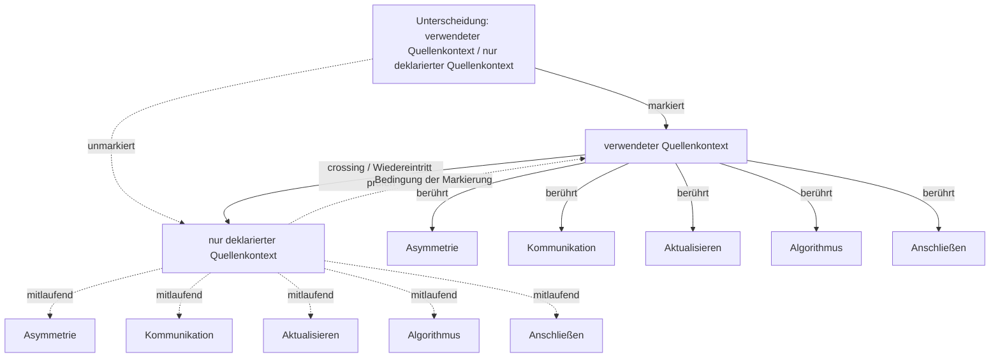

# Automat der Unterscheidung: verwendeter Quellenkontext / nur deklarierter Quellenkontext

Status: Unterscheidungsanalyse; keine Theorieentscheidung

## Operation

- **mark**: Eine Seite wird als bearbeitbare Seite gesetzt.
- **cross**: Ein Wiedereintritt oder Seitenwechsel fragt, was die markierte Seite von ihrer unmarkierten Bedingung abhängig macht.
- **observe**: Beobachtet wird nicht nur der Inhalt, sondern die Unterscheidung, durch die Inhalt sichtbar wird.
- **reenter**: Die Unterscheidung kann selbst wieder in den markierten Zusammenhang eintreten und dort revidierbar werden.

## Markierte Seite

- **Asymmetrie** (`asymmetrie`): Eine relationale Ungleichheit von Anschlussbedingungen, durch die Beteiligte nicht in gleicher Weise aktualisieren, bestimmen, revidieren oder reorganisieren können.
- **Kommunikation** (`kommunikation`): Möglicher Bereich des Anschließens, auf den Anschluss im Projekt nicht reduziert wird.
- **Aktualisieren** (`aktualisieren`): Eine Anschlussmöglichkeit in einen bestimmten Vollzug überführen.
- **Algorithmus** (`algorithmus`): wiederholbare Ordnung bedingter Übergänge
- **Anschließen** (`anschliessen`): Anschließen bezeichnet den Eintritt in einen bereits begonnenen Zusammenhang, durch den eine Möglichkeit aktualisiert und der Raum weiterer Anschlüsse verändert wird.
- **Beurteilen** (`beurteilen`): Unterschiede zwischen möglichen und aktualisierten Ordnungen anhand ausweisbarer Maßstäbe bestimmen, ohne den Maßstab als voraussetzungslos zu behandeln.
- **Form** (`form`): Eine relationale Bestimmung, durch die Unterschiede für weitere Anschlüsse wirksam werden.
- **Komposition** (`komposition`): Ergebnis oder Zusammenhang des Komponierens, in dem Elemente, Übergänge und Relationen angeordnet sind.
- **Kritisieren** (`kritisieren`): Die Bedingungen, Formen und Folgen organisierter Anschlüsse wahrnehmbar und einer begründeten Beurteilung zugänglich machen.
- **Montage** (`montage`): Epistemisches Modell relationaler Formbildung, in dem Auswahl, Unterbrechung, Übergang, Variation, Komposition, Stabilisierung und Revision praktisch sichtbar werden.

## Unmarkierte Seite

- **Asymmetrie** (`asymmetrie`): Eine relationale Ungleichheit von Anschlussbedingungen, durch die Beteiligte nicht in gleicher Weise aktualisieren, bestimmen, revidieren oder reorganisieren können.
- **Kommunikation** (`kommunikation`): Möglicher Bereich des Anschließens, auf den Anschluss im Projekt nicht reduziert wird.
- **Aktualisieren** (`aktualisieren`): Eine Anschlussmöglichkeit in einen bestimmten Vollzug überführen.
- **Algorithmus** (`algorithmus`): wiederholbare Ordnung bedingter Übergänge
- **Anschließen** (`anschliessen`): Anschließen bezeichnet den Eintritt in einen bereits begonnenen Zusammenhang, durch den eine Möglichkeit aktualisiert und der Raum weiterer Anschlüsse verändert wird.
- **Beurteilen** (`beurteilen`): Unterschiede zwischen möglichen und aktualisierten Ordnungen anhand ausweisbarer Maßstäbe bestimmen, ohne den Maßstab als voraussetzungslos zu behandeln.
- **Form** (`form`): Eine relationale Bestimmung, durch die Unterschiede für weitere Anschlüsse wirksam werden.
- **Komposition** (`komposition`): Ergebnis oder Zusammenhang des Komponierens, in dem Elemente, Übergänge und Relationen angeordnet sind.
- **Kritisieren** (`kritisieren`): Die Bedingungen, Formen und Folgen organisierter Anschlüsse wahrnehmbar und einer begründeten Beurteilung zugänglich machen.
- **Montage** (`montage`): Epistemisches Modell relationaler Formbildung, in dem Auswahl, Unterbrechung, Übergang, Variation, Komposition, Stabilisierung und Revision praktisch sichtbar werden.

## Manuskriptanker

- `manuskript\04-form.md:77` — Form ist von Aktualisierung zu unterscheiden, ohne von ihr getrennt zu werden. Form bezeichnet die Bestimmtheit, in der ein Unterschied weitere Anschlüsse orientiert. Aktualisieren bezeichnet den Vollzug, in dem eine Ans
- `manuskript\05-aktualisieren.md:11` — Die Form und ihre Aktualisierung bilden dabei keine zeitlich getrennten Stufen. Es muss nicht zuerst eine vollständige Form bereitliegen, die anschließend nur noch ausgeführt wird. Eine Anschlussmöglichkeit gewinnt im Vo
- `manuskript\05-aktualisieren.md:47` — Der Raum weiterer Anschlussmöglichkeiten ist deshalb kein Vorrat, aus dem bei jeder Aktualisierung ein Element entnommen wird. Er bezeichnet die relationale Ordnung situativ zugänglicher, relevanter und vollziehbarer Ans
- `manuskript\07-programm.md:59` — Nicht jede Form ist deshalb schon ein Programm. Eine Form kann einen einzelnen Folgeanschluss beeinflussen, ohne ein Feld möglicher Anschlüsse selektiv vorzuordnen. Auch eine einmalige Auswahlsituation kann programmatisc
- `manuskript\08-algorithmus.md:91` — Zugleich zeigt die historische Untersuchung algorithmischer Filmkomposition, dass eine solche Ordnung nicht an Computer gebunden ist. Notationen und Schemata konnten filmische Übergänge vorordnen, die anschließend von Me
- `manuskript\13-asymmetrie.md:89` — Die rekursive Struktur ist dieselbe, die das gesamte Projekt leitet: Jede Aktualisierung verändert den Raum weiterer Anschlussmöglichkeiten. Unter asymmetrischen Bedingungen verändern Aktualisierungen diesen Raum jedoch 
- `manuskript\14-kritisieren.md:61` — Jede Aktualisierung verändert den Raum weiterer Anschlussmöglichkeiten. Kritische Folgeanalyse fragt deshalb nicht nur, was eine Entscheidung unmittelbar bewirkt hat. Sie verfolgt, welche späteren Anschlüsse durch sie zu
- `manuskript\17-reorganisieren.md:125` — Das Ergebnis ist keine letzte Organisation. Es ist eine bestimmte, stabilisierte und weiterhin revidierbare Anordnung, an die weitere Vollzüge anschließen. Die Kritik der Organisation von Anschlussmöglichkeiten bezeichne

## Nächste Prüfschritte

- Prüfen, ob die Unterscheidung eine bestehende Definition verändert oder nur eine Beobachtungsform bereitstellt.
- Unmarkierte Seite ausdrücklich benennen, wenn aus der Analyse ein Manuskriptvorschlag werden soll.
- Anschlussfolgen für Form, Aktualisierung, Organisation und Kritik prüfen.
- Bei Manuskriptintegration TODO oder Change Event mit Status der Entscheidung anlegen.

## Grenzen

- Spencer Brown wird hier als operative Beobachtungsfigur verwendet, nicht als neue Grundachse des Buches stabilisiert.
- Das Werkzeug erzeugt keine philosophische Geltung, sondern prüfbare Anschlussbedingungen.
- Textuelle Manuskriptanker sind Lesehinweise, keine Quellenbelege.
