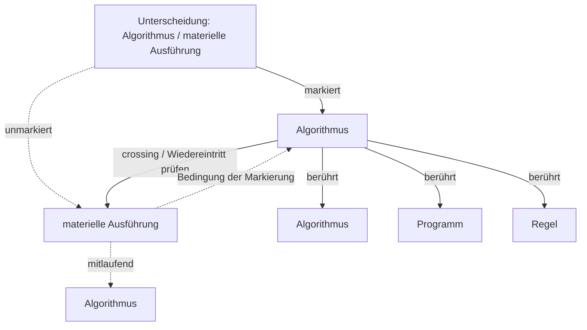

# Automat der Unterscheidung: Algorithmus / materielle Ausführung

Status: Unterscheidungsanalyse; keine Theorieentscheidung

## Operation

- **mark**: Eine Seite wird als bearbeitbare Seite gesetzt.
- **cross**: Ein Wiedereintritt oder Seitenwechsel fragt, was die markierte Seite von ihrer unmarkierten Bedingung abhängig macht.
- **observe**: Beobachtet wird nicht nur der Inhalt, sondern die Unterscheidung, durch die Inhalt sichtbar wird.
- **reenter**: Die Unterscheidung kann selbst wieder in den markierten Zusammenhang eintreten und dort revidierbar werden.

## Markierte Seite

- **Algorithmus** (`algorithmus`): wiederholbare Ordnung bedingter Übergänge
- **Programm** (`programm`): wirksame Vorordnung möglicher Anschlüsse
- **Regel** (`regel`): Eine wiedererkennbare Bedingung, die mögliche Anschlüsse ordnet, ohne den Vollzug vollständig zu bestimmen.

## Unmarkierte Seite

- **Algorithmus** (`algorithmus`): wiederholbare Ordnung bedingter Übergänge

## Manuskriptanker

- `manuskript\08-algorithmus.md:45` — Materielle Unterschiede verändern den Algorithmus, wenn sie seine relevante Übergangsordnung verändern. Numerische Präzision, Zeit- oder Speichergrenzen, Datenrepräsentation, Sensorik und vorgesehene Fehlerpfade können d
- `manuskript\08-algorithmus.md:35` — Algorithmus, Darstellung, Ausführung und Ergebnis sind zu unterscheiden. Eine Notation oder ein Quelltext kann eine algorithmische Ordnung darstellen. Eine Ausführung aktualisiert diese Ordnung unter konkreten Bedingunge
- `manuskript\17-reorganisieren.md:73` — Eine Programmrevision kann andere Eingaben zulassen oder Kriterien neu gewichten. Ob daraus eine Reorganisation folgt, hängt davon ab, wie diese Vorordnung mit Zugängen, Zuständigkeiten und Ausführungsbedingungen verbund
- `manuskript\17-reorganisieren.md:75` — Die Identität eines Algorithmus über verschiedene Darstellungen und Implementierungen hinweg hebt deren materielle Unterschiede deshalb nicht auf. Zwei Implementierungen können auf der maßgeblichen Analyseebene dieselbe 
- `manuskript\06-improvisieren.md:106` — Die Masterarbeit verschiebt diese Figur in das Verhältnis von Improvisation, Programm und Algorithmus. Montage erscheint dort als wiederholtes Reagieren auf Material und entstehende Sequenzen; das bereits Vorgegebene sch
- `manuskript\07-programm.md:105` — Ein Programm kann algorithmische Bestimmungen enthalten, ohne in ihnen aufzugehen. Eine Notation, ein Rhythmus oder ein erreichter Filmzustand kann weitere Möglichkeiten programmatisch gliedern, obwohl daraus kein wieder
- `manuskript\08-algorithmus.md:13` — Der Algorithmus wird häufig mit Computerprogrammen, mathematischen Verfahren oder eindeutigen Wenn-dann-Anweisungen verbunden. Diese Zusammenhänge sind wichtig, bestimmen aber nicht allein die Reichweite des Begriffs. Al
- `manuskript\08-algorithmus.md:37` — Eine algorithmische Ordnung kann beschrieben oder notiert sein, ohne in einem konkreten Zusammenhang bereits wirksam zu werden. Programm ist definitionsgemäß eine wirksame Vorordnung möglicher Anschlüsse. Ein Algorithmus

## Nächste Prüfschritte

- Prüfen, ob die Unterscheidung eine bestehende Definition verändert oder nur eine Beobachtungsform bereitstellt.
- Unmarkierte Seite ausdrücklich benennen, wenn aus der Analyse ein Manuskriptvorschlag werden soll.
- Anschlussfolgen für Form, Aktualisierung, Organisation und Kritik prüfen.
- Bei Manuskriptintegration TODO oder Change Event mit Status der Entscheidung anlegen.

## Grenzen

- Spencer Brown wird hier als operative Beobachtungsfigur verwendet, nicht als neue Grundachse des Buches stabilisiert.
- Das Werkzeug erzeugt keine philosophische Geltung, sondern prüfbare Anschlussbedingungen.
- Textuelle Manuskriptanker sind Lesehinweise, keine Quellenbelege.
