# Automat der Unterscheidung: Tragfähigkeit / normativer Obermaßstab

Status: Unterscheidungsanalyse; keine Theorieentscheidung

```mermaid
flowchart TD
  distinction["Unterscheidung: Tragfähigkeit / normativer Obermaßstab"]
  distinction -->|markiert| marked_tragf_higkeit["Tragfähigkeit"]
  distinction -.->|unmarkiert| unmarked_normativer_oberma_stab["normativer Obermaßstab"]
  marked_tragf_higkeit -->|crossing / Wiedereintritt prüfen| unmarked_normativer_oberma_stab
  unmarked_normativer_oberma_stab -.->|Bedingung der Markierung| marked_tragf_higkeit
  marked_tragf_higkeit -->|berührt| c_aktualisieren["Aktualisieren"]
  marked_tragf_higkeit -->|berührt| c_anschliessen["Anschließen"]
  marked_tragf_higkeit -->|berührt| c_asymmetrie["Asymmetrie"]
  marked_tragf_higkeit -->|berührt| c_fortsetzen["Fortsetzen"]
  marked_tragf_higkeit -->|berührt| c_kommunikation["Kommunikation"]
  unmarked_normativer_oberma_stab -.->|mitlaufend| u_aktualisieren["Aktualisieren"]
  unmarked_normativer_oberma_stab -.->|mitlaufend| u_anschliessen["Anschließen"]
  unmarked_normativer_oberma_stab -.->|mitlaufend| u_asymmetrie["Asymmetrie"]
  unmarked_normativer_oberma_stab -.->|mitlaufend| u_fortsetzen["Fortsetzen"]
  unmarked_normativer_oberma_stab -.->|mitlaufend| u_kommunikation["Kommunikation"]
```

## Operation

- **mark**: Eine Seite wird als bearbeitbare Seite gesetzt.
- **cross**: Ein Wiedereintritt oder Seitenwechsel fragt, was die markierte Seite von ihrer unmarkierten Bedingung abhängig macht.
- **observe**: Beobachtet wird nicht nur der Inhalt, sondern die Unterscheidung, durch die Inhalt sichtbar wird.
- **reenter**: Die Unterscheidung kann selbst wieder in den markierten Zusammenhang eintreten und dort revidierbar werden.

## Markierte Seite

- **Aktualisieren** (`aktualisieren`): Eine Anschlussmöglichkeit in einen bestimmten Vollzug überführen.
- **Anschließen** (`anschliessen`): Anschließen bezeichnet den Eintritt in einen bereits begonnenen Zusammenhang, durch den eine Möglichkeit aktualisiert und der Raum weiterer Anschlüsse verändert wird.
- **Asymmetrie** (`asymmetrie`): Eine relationale Ungleichheit von Anschlussbedingungen, durch die Beteiligte nicht in gleicher Weise aktualisieren, bestimmen, revidieren oder reorganisieren können.
- **Fortsetzen** (`fortsetzen`): Einen Zusammenhang so weiterführen, dass an bereits wirksame Bedingungen angeschlossen wird.
- **Kommunikation** (`kommunikation`): Möglicher Bereich des Anschließens, auf den Anschluss im Projekt nicht reduziert wird.
- **Möglichkeitsraum** (`moeglichkeitsraum`): Relationale Ordnung der unter bestimmten Bedingungen praktisch aktualisierbaren Anschlussmöglichkeiten.
- **Organisieren** (`organisieren`): Mehrere Anschlussbedingungen in einen Zusammenhang bringen, in dem sie einander ermöglichen, begrenzen, priorisieren oder ausschließen.
- **Programm** (`programm`): wirksame Vorordnung möglicher Anschlüsse
- **Reorganisieren** (`reorganisieren`): Die Beziehungen verändern, durch die mehrere Anschlussbedingungen einander stützen, begrenzen und für weitere Vollzüge wirksam werden.
- **Revidieren** (`revidieren`): Begründetes Zurückkommen auf stabilisierte Anschlussbedingungen, um sie im Licht ihrer Wirkungen, veränderter Umstände oder neu erschlossener Möglichkeiten erneut zu bestimmen.

## Unmarkierte Seite

- **Aktualisieren** (`aktualisieren`): Eine Anschlussmöglichkeit in einen bestimmten Vollzug überführen.
- **Anschließen** (`anschliessen`): Anschließen bezeichnet den Eintritt in einen bereits begonnenen Zusammenhang, durch den eine Möglichkeit aktualisiert und der Raum weiterer Anschlüsse verändert wird.
- **Asymmetrie** (`asymmetrie`): Eine relationale Ungleichheit von Anschlussbedingungen, durch die Beteiligte nicht in gleicher Weise aktualisieren, bestimmen, revidieren oder reorganisieren können.
- **Fortsetzen** (`fortsetzen`): Einen Zusammenhang so weiterführen, dass an bereits wirksame Bedingungen angeschlossen wird.
- **Kommunikation** (`kommunikation`): Möglicher Bereich des Anschließens, auf den Anschluss im Projekt nicht reduziert wird.
- **Möglichkeitsraum** (`moeglichkeitsraum`): Relationale Ordnung der unter bestimmten Bedingungen praktisch aktualisierbaren Anschlussmöglichkeiten.
- **Organisieren** (`organisieren`): Mehrere Anschlussbedingungen in einen Zusammenhang bringen, in dem sie einander ermöglichen, begrenzen, priorisieren oder ausschließen.
- **Programm** (`programm`): wirksame Vorordnung möglicher Anschlüsse
- **Reorganisieren** (`reorganisieren`): Die Beziehungen verändern, durch die mehrere Anschlussbedingungen einander stützen, begrenzen und für weitere Vollzüge wirksam werden.
- **Revidieren** (`revidieren`): Begründetes Zurückkommen auf stabilisierte Anschlussbedingungen, um sie im Licht ihrer Wirkungen, veränderter Umstände oder neu erschlossener Möglichkeiten erneut zu bestimmen.

## Manuskriptanker

- `manuskript\schluss.md:91` — Anschlussmöglichkeiten bestehen unter organisierten Bedingungen. Ihre Aktualisierung verändert diese Bedingungen, auch wenn die Veränderung weder beabsichtigt noch dauerhaft ist. Wo die Beziehungen mehrerer Bedingungen n
- `manuskript\11-organisieren.md:77` — Eine Entscheidung erhält im organisierten Zusammenhang eine doppelte Funktion. Sie aktualisiert eine Anschlussmöglichkeit in einer bestimmten Situation. Wird sie festgehalten, mitgeteilt und in weitere Abläufe aufgenomme
- `manuskript\17-reorganisieren.md:125` — Das Ergebnis ist keine letzte Organisation. Es ist eine bestimmte, stabilisierte und weiterhin revidierbare Anordnung, an die weitere Vollzüge anschließen. Die Kritik der Organisation von Anschlussmöglichkeiten bezeichne
- `manuskript\schluss.md:100` — > **Eine tragfähige Organisation von Anschlussmöglichkeiten stabilisiert Bedingungen gemeinsamen Handelns und erhält zugleich die Möglichkeit, diese Bedingungen aufgrund ihrer erfahrenen Folgen wahrzunehmen, zu beantwort
- `manuskript\05-aktualisieren.md:47` — Der Raum weiterer Anschlussmöglichkeiten ist deshalb kein Vorrat, aus dem bei jeder Aktualisierung ein Element entnommen wird. Er bezeichnet die relationale Ordnung situativ zugänglicher, relevanter und vollziehbarer Ans
- `manuskript\07-programm.md:59` — Nicht jede Form ist deshalb schon ein Programm. Eine Form kann einen einzelnen Folgeanschluss beeinflussen, ohne ein Feld möglicher Anschlüsse selektiv vorzuordnen. Auch eine einmalige Auswahlsituation kann programmatisc
- `manuskript\13-asymmetrie.md:89` — Die rekursive Struktur ist dieselbe, die das gesamte Projekt leitet: Jede Aktualisierung verändert den Raum weiterer Anschlussmöglichkeiten. Unter asymmetrischen Bedingungen verändern Aktualisierungen diesen Raum jedoch 
- `manuskript\14-kritisieren.md:13` — Die Kritik richtet sich damit nicht notwendig gegen das Bestehen von Organisation. Sie untersucht, wie eine bestimmte Weise des Organisierens weitere Anschlüsse ermöglicht, begrenzt, priorisiert oder ausschließt. Ihr Geg

## Nächste Prüfschritte

- Prüfen, ob die Unterscheidung eine bestehende Definition verändert oder nur eine Beobachtungsform bereitstellt.
- Unmarkierte Seite ausdrücklich benennen, wenn aus der Analyse ein Manuskriptvorschlag werden soll.
- Anschlussfolgen für Form, Aktualisierung, Organisation und Kritik prüfen.
- Bei Manuskriptintegration TODO oder Change Event mit Status der Entscheidung anlegen.

## Grenzen

- Spencer Brown wird hier als operative Beobachtungsfigur verwendet, nicht als neue Grundachse des Buches stabilisiert.
- Das Werkzeug erzeugt keine philosophische Geltung, sondern prüfbare Anschlussbedingungen.
- Textuelle Manuskriptanker sind Lesehinweise, keine Quellenbelege.
